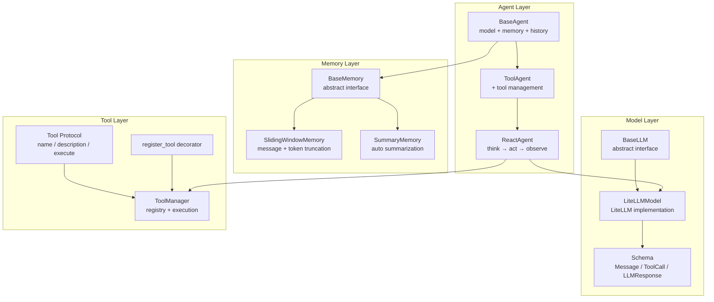
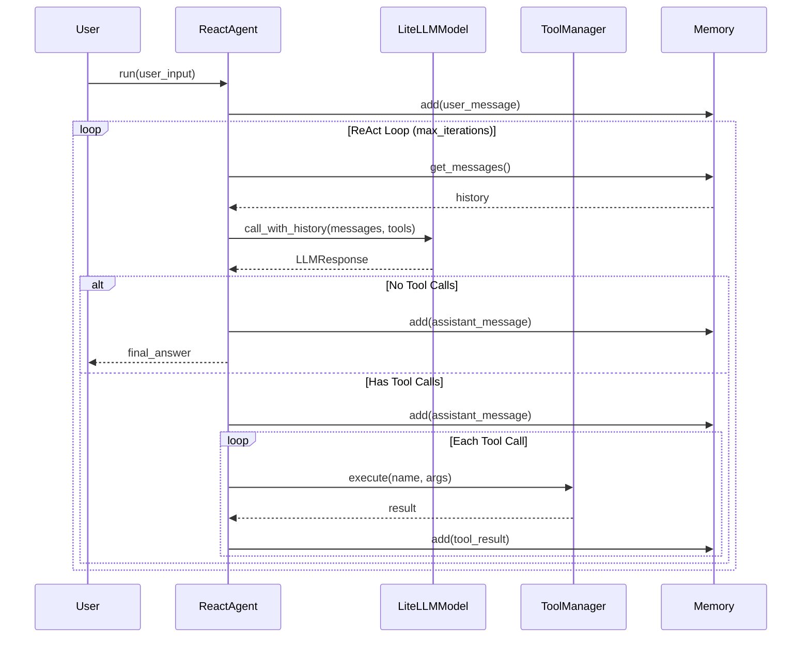

# Terminal Bench

[](https://opensource.org/licenses/MIT)
[](https://www.python.org/downloads/)

轻量级 AI Agent 框架，基于 LiteLLM 构建，支持多模型、工具调用和智能记忆管理。

## 特性

- 🔌 **多模型支持** - 通过 LiteLLM 统一接口，支持 OpenAI、Anthropic、Gemini 等主流模型
- 🛠️ **工具调用** - 基于 Protocol 的工具定义，`@register_tool` 装饰器自动注册
- 🧠 **智能记忆** - 滑动窗口 + 自动摘要两种策略，自动管理上下文长度
- 🔄 **ReAct 循环** - think → act → observe 标准推理循环
- 📊 **调试友好** - 彩色日志输出，token 消耗和成本追踪

## 安装

```bash
pip install -r requirements.txt
```

**依赖：**
- `litellm>=1.80.0`
- `pydantic>=2.12.5`

## 架构设计



### 核心流程



## 项目结构

```
terminal_bench/
├── agent/                  # Agent 层
│   ├── base.py             # BaseAgent 抽象基类
│   ├── tool_agent.py       # ToolAgent（支持工具调用）
│   └── react_agent.py      # ReactAgent（ReAct 循环）
├── model/                  # 模型层
│   ├── base.py             # BaseLLM 抽象基类
│   ├── litellm_model.py    # LiteLLM 实现
│   └── schema.py           # Message, ToolCall, LLMResponse
├── memory/                 # 记忆层
│   ├── base.py             # BaseMemory 抽象基类
│   ├── sliding_window.py   # 滑动窗口策略
│   └── summary.py          # 自动摘要策略
├── tool/                   # 工具层
│   ├── base.py             # Tool Protocol
│   └── manager.py          # ToolManager + @register_tool
├── prompt/                 # 提示词模板
├── config/                 # 配置管理
├── debug/                  # 调试工具（彩色日志、日志收集器）
├── harbor/                 # Agent 评测框架（Terminal-Bench 官方工具）
└── test/                   # 测试
```

## 快速开始

### 1. 配置模型

复制配置示例并编辑 `config/config.yaml`：

```bash
cp config/config_example.yaml config/config.yaml
```

```yaml
debug: true
summary_model: gpt-4o-mini

models:
  gpt-4o-mini:
    api_type: openai
    base_url: https://api.openai.com/v1
    api_key: sk-xxx

  # 自定义模型支持成本配置
  gemini-2.5-flash:
    api_type: openai
    base_url: https://your-proxy.com/v1
    api_key: your-key
    cost:
      input_cost_per_token: 0.0000003
      output_cost_per_token: 0.00000252
      max_tokens: 8192
      max_input_tokens: 1048576
```

### 2. 定义工具

使用 `@register_tool` 装饰器定义工具：

```python
from tool import register_tool

@register_tool
class GetWeather:
    name = "get_weather"
    type = "function"
    description = "Get the weather for a city."
    parameters = {
        "type": "object",
        "properties": {"city": {"type": "string", "description": "City name"}},
        "required": ["city"],
    }

    def init(self) -> None:
        """工具初始化时调用"""
        pass

    def execute(self, city: str) -> str:
        """执行工具逻辑"""
        return f"The weather in {city} is sunny, 25°C."
```

### 3. 创建 Agent

```python
import asyncio
from agent.react_agent import ReactAgent
from config.base import ModelConfig
from model.litellm_model import LiteLLMModel

config = ModelConfig.load()
model = LiteLLMModel(**config.get_model("gpt-4o-mini"))

agent = ReactAgent(
    model=model,
    tools=["get_weather"],
    system_prompt="You are a helpful assistant.",
    max_iterations=10,  # 最大推理轮数
)

result = asyncio.run(agent.run("What's the weather in Beijing?"))
print(result)
```

## 核心组件

### Agent 层

| 类 | 说明 |
|---|---|
| `BaseAgent` | 抽象基类，持有 model、memory，管理对话历史 |
| `ToolAgent` | 扩展 BaseAgent，支持工具注册和执行 |
| `ReactAgent` | ReAct 循环实现，think → act → observe |

### Model 层

| 类 | 说明 |
|---|---|
| `BaseLLM` | 抽象接口，定义 `call()` 和 `call_with_history()` |
| `LiteLLMModel` | LiteLLM 实现，支持所有 LiteLLM 兼容模型 |
| `Message` | Pydantic 消息模型（system/user/assistant/tool） |
| `ToolCall` | 工具调用结构 |
| `LLMResponse` | 统一响应格式，含 content、tool_calls、usage |

### Memory 层

| 策略 | 适用场景 | 特点 |
|------|---------|------|
| `SlidingWindowMemory` | 短对话 | 按消息数/token 数截断，保留最新消息 |
| `SummaryMemory` | 长对话 | 自动摘要压缩，持久化到文件，保证不超 max_tokens |

```python
from memory import SlidingWindowMemory, SummaryMemory

# 滑动窗口：限制消息数和 token 数
memory = SlidingWindowMemory(max_messages=20, max_tokens=4000)

# 自动摘要：适合长任务，max_tokens 自动从 litellm 获取
memory = SummaryMemory(
    task_id="task_001",      # 任务 ID，用于持久化
    reserve_ratio=0.3,       # 保留给最近消息的比例
    workspace="workspace",   # 摘要存储目录
)
```

### Tool 层

工具需实现 `Tool` Protocol：

```python
from typing import Protocol

class Tool(Protocol):
    name: str           # 工具名称
    type: str           # 固定为 "function"
    description: str    # 工具描述

    def init(self) -> None: ...
    def execute(self, **kwargs) -> str: ...
```

## 调试

开启 debug 模式后，会输出彩色日志：

```yaml
# config/config.yaml
debug: true
```

日志示例：
```
14:30:15 DEBUG [ReactAgent] User: What's the weather?
14:30:15 DEBUG [ReactAgent] Iteration 1/10
14:30:16 INFO  [LiteLLM] Response: in=150, out=45, cost=$0.000195
14:30:16 INFO  [ReactAgent] Tool call: get_weather({"city": "Beijing"})
14:30:16 INFO  [ReactAgent] Tool result: The weather in Beijing is sunny, 25°C.
14:30:17 INFO  [ReactAgent] Final: The weather in Beijing is sunny with 25°C.
```

使用 `LogCollector` 收集日志：

```python
from debug.log import LogCollector, Logger

log = Logger("MyApp")

with LogCollector() as collector:
    log.info("Step 1")
    log.info("Step 2")

print(collector.to_text())  # "Step 1\nStep 2"
```

## Harbor 评测框架

本项目包含 [Harbor](./harbor/) 子模块，这是 Terminal-Bench 官方评测框架，用于：

- 评测各类 AI Agent（Claude Code、OpenHands、Codex CLI 等）
- 构建和分享自定义 benchmark
- 通过 Daytona、Modal 等云服务并行运行评测
- 生成 RL 优化所需的 rollout 数据

详见 [harbor/README.md](./harbor/README.md)。

## 运行测试

```bash
python -m test.test_agent
python -m test.test_model
```

## License

[MIT License](LICENSE) © 2025 Yiran Peng

