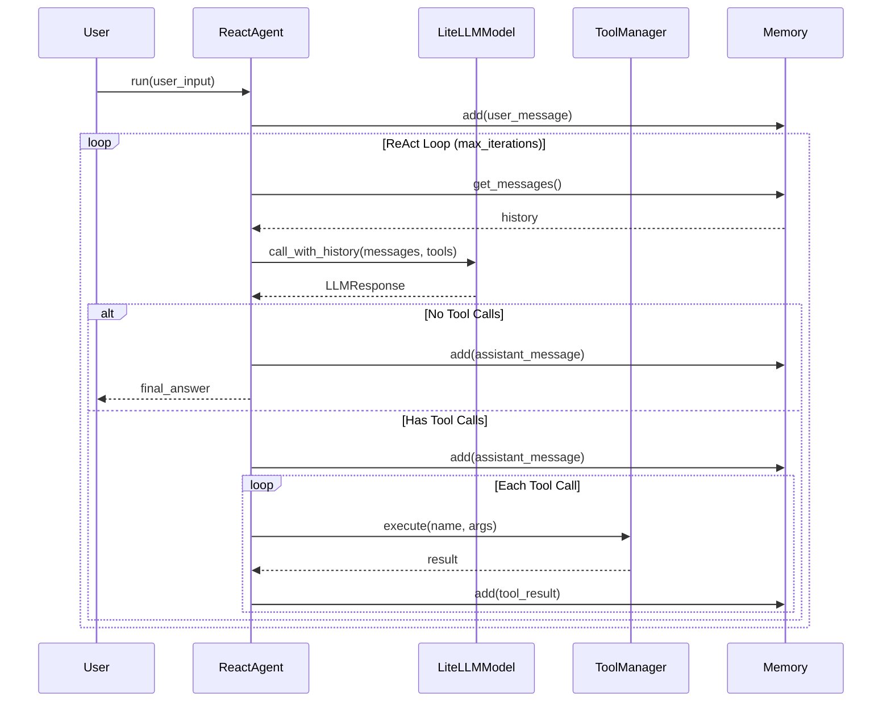

# Terminal Bench

轻量级 AI Agent 框架，基于 LiteLLM 构建，支持多模型、工具调用和智能记忆管理。

## 架构设计

```mermaid
graph TB
    subgraph Agent Layer
        BA[BaseAgent<br/>model + memory + history]
        TA[ToolAgent<br/>+ tool management]
        RA[ReactAgent<br/>think → act → observe]
        BA --> TA --> RA
    end

    subgraph Model Layer
        BL[BaseLLM<br/>abstract interface]
        LM[LiteLLMModel<br/>LiteLLM implementation]
        SC[Schema<br/>Message / ToolCall / LLMResponse]
        BL --> LM
    end

    subgraph Memory Layer
        BM[BaseMemory<br/>abstract interface]
        SW[SlidingWindowMemory<br/>message + token truncation]
        SM[SummaryMemory<br/>auto summarization]
        BM --> SW
        BM --> SM
    end

    subgraph Tool Layer
        TP[Tool Protocol<br/>name / description / execute]
        TM[ToolManager<br/>registry + execution]
        RT[@register_tool<br/>decorator]
        TP --> TM
        RT --> TM
    end

    RA --> LM
    RA --> TM
    BA --> BM
    LM --> SC
```

### 核心流程



## 项目结构

```
terminal_bench/
├── agent/                  # Agent 层
│   ├── base.py             # BaseAgent 抽象基类
│   ├── tool_agent.py       # ToolAgent（支持工具调用）
│   └── react_agent.py      # ReactAgent（ReAct 循环）
├── model/                  # 模型层
│   ├── base.py             # BaseLLM 抽象基类
│   ├── litellm_model.py    # LiteLLM 实现
│   └── schema.py           # Message, ToolCall, LLMResponse
├── memory/                 # 记忆层
│   ├── base.py             # BaseMemory 抽象基类
│   ├── sliding_window.py   # 滑动窗口策略
│   └── summary.py          # 自动摘要策略
├── tool/                   # 工具层
│   ├── base.py             # Tool Protocol
│   └── manager.py          # ToolManager + @register_tool
├── prompt/                 # 提示词模板
├── config/                 # 配置管理
├── debug/                  # 调试工具
└── test/                   # 测试
```

## 快速开始

### 1. 配置模型

编辑 `config/config.yaml`：

```yaml
debug: true
summary_model: gpt-4o-mini

models:
  gpt-4o-mini:
    api_type: openai
    base_url: https://api.openai.com/v1
    api_key: sk-xxx
```

### 2. 定义工具

```python
from tool import register_tool

@register_tool
class GetWeather:
    name = "get_weather"
    type = "function"
    description = "Get the weather for a city."
    parameters = {
        "type": "object",
        "properties": {"city": {"type": "string"}},
        "required": ["city"],
    }

    def init(self) -> None:
        pass

    def execute(self, city: str) -> str:
        return f"The weather in {city} is sunny."
```

### 3. 创建 Agent

```python
import asyncio
from agent.react_agent import ReactAgent
from config.base import ModelConfig
from model.litellm_model import LiteLLMModel

config = ModelConfig.load()
model = LiteLLMModel(**config.get_model("gpt-4o-mini"))

agent = ReactAgent(
    model=model,
    tools=["get_weather"],
    system_prompt="You are a helpful assistant.",
)

result = asyncio.run(agent.run("What's the weather in Beijing?"))
```

## 记忆策略

| 策略 | 适用场景 | 特点 |
|------|---------|------|
| `SlidingWindowMemory` | 短对话 | 按消息数/token 截断 |
| `SummaryMemory` | 长对话 | 自动摘要压缩，保证不超 max_tokens |

```python
from memory import SlidingWindowMemory, SummaryMemory

# 滑动窗口
memory = SlidingWindowMemory(max_messages=20, max_tokens=4000)

# 自动摘要（max_tokens 自动从 litellm 获取）
memory = SummaryMemory(task_id="task_001", reserve_ratio=0.3)
```

## 运行测试

```bash
python -m test.test_agent
python -m test.test_model
```

