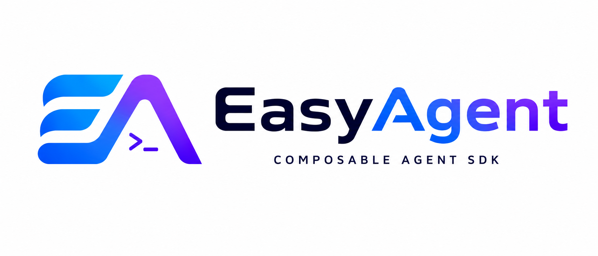
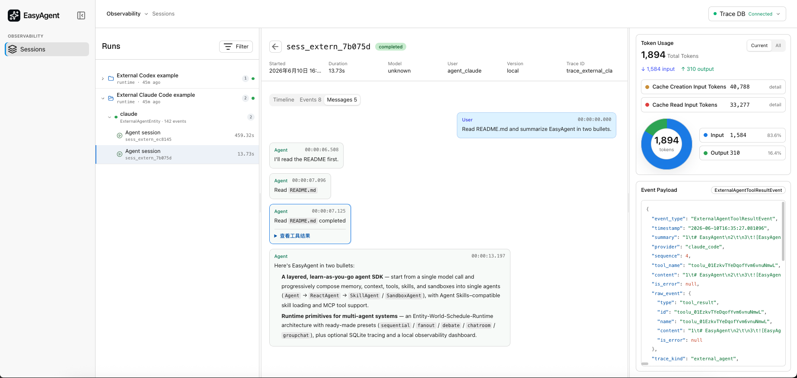

# EasyAgent



[](https://badge.fury.io/py/easy-agent-sdk)
[](https://opensource.org/licenses/MIT)
[](https://www.python.org/downloads/)

English | [简体中文](README_CN.md)

EasyAgent is a lightweight agent SDK organised as a small set of composable
layers. The goal is to let you learn agent design step by step: start with a
single model call, then add memory and context, build up to a ReAct loop with
tools and skills, drop into a sandbox, and finally orchestrate multiple agents
through the Entity-World-Schedule architecture.

What you get:

- A small single-agent stack: model, memory, context, tools, skills, sandbox.
- Runtime primitives for multi-agent systems: Entity, World, Schedule, Runtime.
- Agent Skills-compatible loading from `.easyagent/skills`, `.claude/skills`,
  `.codex/skills`, or any directory you choose.
- Optional tracing, stores, and a local dashboard when you need observability.

## Install

```bash
pip install easy-agent-sdk
```

From source:

```bash
git clone https://github.com/SNHuan/EasyAgent.git
cd EasyAgent
pip install -e ".[dev]"
```

The default install includes model adapters, sandbox helpers, web helpers, and
MCP integration.

## Quick Start

```python
import asyncio
from easyagent import LiteLLMModel, ReactAgent


async def main():
    agent = ReactAgent(
        model=LiteLLMModel("gpt-4o-mini"),
        system_prompt="You are a concise assistant.",
        max_iterations=5,
    )
    result = await agent.run("What is 2 + 2?")
    print(result.final_output)


asyncio.run(main())
```

## Configuration

Create `easyagent/config/config.yaml` or configure LiteLLM through environment
variables:

For local development, copy `.env.example` to `.env` and fill in only the
variables you need. This single example file covers EasyAgent core settings,
Serper, Claude Code SDK, and Codex/OpenAI SDK authentication.

```yaml
debug: false

models:
  gpt-4o-mini:
    api_type: openai
    base_url: https://api.openai.com/v1
    api_key: sk-xxx
```

## Layered Design

EasyAgent is organised around three layers:

```text
Single-agent:    Model + Memory + Context + Tool → Agent / ReactAgent (+ skills / sandbox)
Multi-agent:     Entity + World + Schedule → Runtime
Presets:         sequential / fanout / debate / chatroom / groupchat
```

- **Model** — provider adapter and message schema.
- **Memory + Context** — store conversation history and decide what reaches
  the model each turn.
- **Agent** — reusable definition for a model, memory/context factories, and
  optional tools, skills, and sandbox. `AgentSession` owns each run.
  An internal `ReactRunEngine` drives the same ReAct state transition for
  `run()` and `stream()`.
  `SkillAgent` and `SandboxAgent` are convenience wrappers over the same
  composable `ReactAgent` implementation.
- **Entity** — wraps an Agent (or any async actor) for multi-agent participation.
  Protocol: `id` property + `async act(Perception) -> Action | None`.
- **World** — the environment entities perceive and act upon.
  Built-ins: `ConversationWorld`, `PipelineWorld`, `SpatialWorld`, `StatefulWorld`.
- **Schedule** — determines who acts next.
  Built-ins: `TakeTurns`, `RoundRobin`, `AllParallel`, `Reactive`, `MaxTicks`, `UntilIdle`.
- **Runtime** — the perceive-act-apply loop wiring Entity + World + Schedule.
  When connected to an `EventBus`, it emits runtime/tick/entity events and
  links child agent sessions back to the same runtime run.

See [docs/architecture.md](docs/architecture.md) for the full design guide.

## Learning Path

The examples are ordered by layer. Each one introduces one new idea:

```bash
# Single agent (00–06)
python examples/00_model_call.py             # Just call the model
python examples/01_single_turn_agent.py      # Compose a minimal Agent
python examples/02_memory_and_context.py     # Memory + Context
python examples/03_react_with_tools.py       # ReactAgent + tool calls
python examples/04_skills_lazy_loading.py    # SkillAgent (SKILL.md packages)
python examples/05_sandbox_agent.py          # SandboxAgent (bash, write/read file)
python examples/06_custom_tool.py            # Define your own tool

# Multi-agent: Entity-World-Schedule (07–14)
python examples/07_two_agents_talk.py        # LLMEntity + ConversationWorld + RoundRobin
python examples/08_sequential.py             # sequential() preset
python examples/09_chatroom.py               # Manual turn-taking + if/else
python examples/10_groupchat.py              # Reactive schedule, LLM picks next
python examples/11_debate_and_judge.py       # Third-party judge after debate
python examples/12_nested.py                 # TeamEntity: Runtime-as-Entity nesting
python examples/13_shared_state.py           # SharedState + StatefulWorld blackboard
python examples/14_advanced_runtime.py       # SpatialWorld: 2D grid + range-limited perception

# MCP examples (external tool sources)
python examples/mcp/fastmcp_in_memory.py     # Wrap a FastMCP server as EasyAgent tools
python examples/mcp/config_load.py           # Load tools from mcp_config.example.json
```

## Tools

```python
from easyagent import LiteLLMModel, ReactAgent, Tool, ToolContext, ToolResult


class GetWeather(Tool):
    context_aware = True
    name = "get_weather"
    type = "function"
    description = "Get weather for a city."
    parameters = {
        "type": "object",
        "properties": {"city": {"type": "string"}},
        "required": ["city"],
    }

    async def execute(
        self,
        arguments: dict,
        context: ToolContext,
    ) -> ToolResult:
        city = arguments["city"]
        return ToolResult(content=f"Sunny in {city}.")


agent = ReactAgent(
    model=LiteLLMModel("gpt-4o-mini"),
    tools=[GetWeather()],
)
```

Pass tool classes or instances directly via `tools=[...]`. The ReAct loop
continues while the model returns tool calls; a plain assistant message with no
tool calls is treated as the final answer. `context_aware = True` explicitly
selects the new `execute(arguments, context)` contract. Existing
`execute(city: str, **kwargs) -> str` tools remain supported through a legacy
Adapter.

## Events and Hooks

Events and hooks serve different purposes:

- `EventBus` is the passive observation plane. Subscriber return values are
  ignored, and subscriber failures are logged without changing agent execution.
- `HookManager` is the awaited control plane. Hook failures propagate, and hook
  results can block or transform execution.

Tool hooks are registered on the reusable Agent definition and run in
registration order:

```python
from easyagent import (
    BeforeToolCallHook,
    BeforeToolCallResult,
    HookManager,
    ReactAgent,
)

hooks = HookManager()
hooks.on(
    BeforeToolCallHook,
    lambda hook: BeforeToolCallResult(
        block=hook.tool_name == "delete_file",
        reason="Destructive tools are disabled.",
    ),
)

agent = ReactAgent(model=model, tools=tools, hooks=hooks)
```

`BeforeToolCallHook` can replace arguments or block a call.
`AfterToolCallHook` can replace the structured `ToolResult`. To stop the active
run from a context-aware tool or another in-process controller, call
`session.request_stop(...)`; publish a `StopEvent` separately only when
observers also need a notification.

## MCP Tools

EasyAgent can consume MCP servers as external tool sources. MCP support is
included in the default install.

Use a standard FastMCP/MCP config. The `mcpServers` keys act as natural tool
categories:

```json
{
  "mcpServers": {
    "literature": {
      "command": "python",
      "args": ["./examples/mcp/servers/literature_server.py"]
    }
  }
}
```

Register discovered MCP tools into a `ToolManager`, then decide per session
which tools are visible to the model:

```python
from easyagent import LiteLLMModel, ReactAgent, ToolManager, register_mcp_tools

tool_manager = ToolManager(discover_builtin=False)
literature_tools = await register_mcp_tools(
    tool_manager,
    mcp_config,
    servers=["literature"],
)

agent = ReactAgent(model=LiteLLMModel("gpt-4o-mini"), tool_manager=tool_manager)
session = agent.create_session()
session.enabled_tools.extend(literature_tools)
```

You can also filter FastMCP tools by tags:

```python
await register_mcp_tools(tool_manager, mcp_config, tags=["demo"])
```

See `examples/mcp/` for runnable examples.

## Skills

Skills are [Agent Skills](https://agentskills.io/) compatible directory
packages loaded on demand. `SKILL.md` is the required entry file and must
include YAML frontmatter with at least `name` and `description`. The `name`
must match the parent directory name.

```text
.easyagent/skills/my-skill/
├── SKILL.md
├── references/
├── templates/
├── assets/
└── scripts/
```

```python
from easyagent import LiteLLMModel, ReactAgent

agent = ReactAgent(
    model=LiteLLMModel("gpt-4o-mini"),
    skills=["my-skill"],
    sandbox={"type": "local"},
)
```

Sandbox config dictionaries and zero-argument factories create one sandbox
instance per session. Passing an existing sandbox instance remains supported;
concurrent sessions then lease that shared instance serially.

`SkillAgent` and `SandboxAgent` remain available as convenience wrappers.

By default EasyAgent discovers skills from `.easyagent/skills`. Set
`EA_SKILLS_DIR` to load skills from another Agent Skills-compatible directory
such as `.claude/skills` or `.codex/skills`. Multiple directories can be
separated with the platform path separator (`:` on macOS/Linux, `;` on
Windows).

## Multi-agent

Wrap any `Agent` as an `LLMEntity`, then compose with presets:

```python
from easyagent import LiteLLMModel, ReactAgent, LLMEntity, sequential

model = LiteLLMModel("gpt-4o-mini")
researcher = LLMEntity("researcher", ReactAgent(model=model, name="researcher", system_prompt="..."))
writer     = LLMEntity("writer",     ReactAgent(model=model, name="writer",     system_prompt="..."))
reviewer   = LLMEntity("reviewer",   ReactAgent(model=model, name="reviewer",   system_prompt="..."))

result = await sequential([researcher, writer, reviewer], "Write a product blurb.")
print(result.last_speech)
```

Available presets: `sequential` / `fanout` / `chatroom` / `groupchat` /
`debate`. For recursive nesting, wrap an inner `Runtime` as a `TeamEntity`
and drop it into any outer pipeline. See `examples/07_*` through
`examples/14_*` for walkthroughs.

### Custom World

The architecture is extensible beyond conversation. Swap the World to get
entirely different behaviour with the same Entity and Schedule:

```python
from easyagent import SpatialWorld, Grid2D, Runtime, RoundRobin, MaxTicks

grid = Grid2D()
grid.place("alice", (0, 0))
grid.place("bob", (5, 5))

world = SpatialWorld(grid=grid, listen_radius=3.0)
schedule = MaxTicks(inner=RoundRobin(ids=["alice", "bob"]), n=10)

rt = Runtime(world=world, entities={"alice": alice, "bob": bob}, schedule=schedule)
result = await rt.run("Start exploring")
```

## Observability



EasyAgent can persist agent and runtime traces to SQLite and open a local
dashboard for logs, events, message history, and token usage:

```bash
easyagent dashboard
```

By default the CLI reads `.easyagent/traces.db`. You can point it at another
trace store and open the browser automatically:

```bash
easyagent dashboard --db path/to/traces.db --open
```

The dashboard understands both standalone agent sessions and runtime traces, so
runtime/world/entity/session trees appear automatically when your application
writes runtime events into the selected trace store.

Trace stores are observability stores; they do not restore a live
`AgentSession`. Execution state is a separate concern covered below.

Custom events can opt into dashboard surfaces by attaching a `DisplayHint`.
For example, this event is persisted as `PlannerStepEvent` and rendered in the
Messages tab as an assistant bubble:

```python
from easyagent import CustomTraceEvent, DisplayHint, EventBus, MemoryStore, TraceRecorder

store = MemoryStore()
bus = EventBus()
TraceRecorder(store).attach(bus)

await bus.publish(
    CustomTraceEvent(
        event_type="PlannerStepEvent",
        session_id="sess_planner",
        agent_id="planner",
        summary="Planner selected search_docs",
        payload={"step": "search_docs"},
        display=DisplayHint.messages(
            "Need to inspect README and pyproject first.",
            role="assistant",
            title="Planner step",
            source="planner",
        ),
    )
)
```

## Checkpoints

Persist execution state through a separate checkpoint store:

```python
from easyagent import ReactAgent, SQLiteCheckpointStore

checkpoints = SQLiteCheckpointStore(".easyagent/checkpoints.db")
agent = ReactAgent(
    model=model,
    checkpoint_store=checkpoints,
    checkpoint_identity="release-writer/v1",
)
result = await agent.run("Draft the release notes")

checkpoint = await checkpoints.load(result.session.session_id)
if checkpoint is not None:
    report = agent.check_checkpoint(checkpoint)
    if report.compatible:
        restored_session = agent.restore_session(checkpoint)
        print(restored_session.status, restored_session.iteration_count)
        if restored_session.status.value == "running":
            output = await restored_session.resume()
    else:
        print("\n".join(report.errors))
```

The agent saves after each completed loop step and once more after lifecycle
cleanup reaches `completed`. Configuring a checkpoint store is fail-closed:
non-JSON state or a store failure fails the run instead of silently claiming
durability. `AgentCheckpoint` includes messages, loop state, tool/skill
selection, metadata, and result bookkeeping; it deliberately excludes the
sandbox, resources, EventBus, and in-flight tool side effects.

`SQLiteCheckpointStore` persists the latest checkpoint for each session and
moves database `save`/`load` operations off the event loop.
`MemoryCheckpointStore` is the process-local Adapter for tests and notebooks.
Unknown checkpoint schema versions raise
`UnsupportedCheckpointVersionError` instead of leaking validation internals.
`Agent.check_checkpoint()` is a read-only preflight that reports Agent
identity/name mismatches, missing registered tools, and missing declared skills
without creating a session, triggering capability discovery, or executing
anything. Use
`report.issues[*].code` for programmatic decisions and `report.errors` for
display. The default checkpoint identity is the fully qualified Agent class
name; set `checkpoint_identity` explicitly when identity must survive class or
module renames. `agent_type` remains diagnostic metadata, not a compatibility
key.

`Agent.restore_session()` checks compatibility and rebuilds an independent
`AgentSession` with its messages, loop bookkeeping, capability selection, and
metadata. It does not enter the lifecycle, call the model, execute tools, load
skills, or recreate runtime resources. Incompatible checkpoints raise
`IncompatibleCheckpointError`; structurally invalid restorable state raises
`InvalidCheckpointStateError`.

Restoration and execution remain separate actions. Calling `resume()` explicitly
continues only a Session restored from a `running` checkpoint. It preserves
messages, iteration count, loop state, and completed steps; a terminal saved
step only completes the lifecycle and is not executed twice. Resume is
single-use even when execution fails, so retries must reload the last safe
checkpoint. Invalid calls raise `SessionNotResumableError` with reason
`not_restored`, `checkpoint_not_running`, or `already_resumed`.

The initial resume Interface is non-streaming. `resume()` recreates
lifecycle-owned resources through the normal start/end hooks, but there is no
implicit resume during load or restore.

## Public API

The root package exposes the common SDK surface:

```python
from easyagent import (
    # single-agent
    Agent, ReactAgent, SkillAgent, SandboxAgent,
    AgentSession, AgentRunResult, SessionNotResumableError,
    AgentCheckpoint, CheckpointCompatibilityIssue,
    CheckpointCompatibilityReport, CheckpointStore,
    IncompatibleCheckpointError, InvalidCheckpointStateError,
    MemoryCheckpointStore, SQLiteCheckpointStore,
    UnsupportedCheckpointVersionError,
    LiteLLMModel, Message,
    EventBus, MessageEvent,
    HookManager, BeforeToolCallHook, BeforeToolCallResult, AfterToolCallHook,
    Tool, ToolContext, ToolResult, ToolManager, SkillManager, register_tool,
    MCPToolset, load_mcp_tools, register_mcp_tools,
    ExternalRunRequest, LegacyExternalRunnerAdapter,
    # multi-agent protocols
    Entity, World, Schedule, Runtime, RuntimeResult,
    # perception & action types
    Perception, Speak, Silent, ChatMessage,
    # entities
    LLMEntity, TeamEntity, HumanEntity,
    # worlds
    ConversationWorld, PipelineWorld, SpatialWorld, StatefulWorld, SharedState,
    # schedules
    TakeTurns, RoundRobin, AllParallel, MaxTicks, UntilIdle, Reactive,
    # presets
    sequential, fanout, debate, chatroom, groupchat,
)
```

## Module Layout

```text
easyagent/
├── agent/      # Agent definitions, AgentSession, internal ReactRunEngine
├── checkpoint/ # Serializable AgentCheckpoint + persistence boundary
├── core/       # Entity, World, Schedule protocols + Runtime loop
├── entities/   # LLMEntity, TeamEntity, HumanEntity
├── worlds/     # ConversationWorld, PipelineWorld, SpatialWorld, StatefulWorld
├── presets.py  # sequential, fanout, debate, chatroom, groupchat
├── context/    # SlidingWindowContext, SummaryContext, MultiAgentFormatter
├── events/     # MessageEvent, EventBus, telemetry events
├── hooks/      # Awaited control-plane hooks
├── memory/     # InMemoryMemory
├── model/      # LiteLLMModel + Message schema
├── prompt/     # System-prompt builders
├── sandbox/    # Local / Docker sandboxes
├── skill/      # SKILL.md loading
├── tool/       # Tool registry + built-ins (bash, file, web, skill helpers)
├── config/     # Config loading
└── debug/      # Logging
```

## License

[MIT License](LICENSE) © 2025 Yiran Peng
